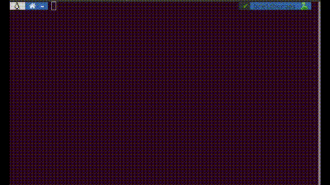

# BreizhCrops:
#### A Time Series Dataset for Crop Type Mapping


Check our [Breizhcrops Tutorial Colab Notebook](https://colab.research.google.com/drive/1i0M_X5-ytFhF0NO-FjhKiqnraclSEIb0?usp=sharing) for quick hands-on examples.

### Installation
#### Linux and macOS

Install Breizhcrops as python package from [PyPI](https://pypi.org/project/breizhcrops/)!
```
pip install breizhcrops
```

#### Windows

If you use Windows, execute these lines.
```
git clone https://github.com/dl4sits/BreizhCrops.git
pip install torch==1.6.0 -f https://download.pytorch.org/whl/torch_stable.html
conda install gdal fiona geopandas
pip install .
```

### Getting Started

This minimal working example
```python
# import package
import breizhcrops as bzh

# initialize and download FRH04 data
dataset = bzh.BreizhCrops("frh04")

# get data sample
x, y, field_id = dataset[0]

# load pretrained model
model = bzh.models.pretrained("Transformer")

# create a batch of batchsize 1
x = x.unsqueeze(0)

# perform inference
y_pred = model(x)
```
downloads the FRH04 dataset partition (used for evaluation), loads a pretrained model and performs a prediction on the first sample.





Furthermore, for a detailed data analysis you can check the [Hands-on Tutorial on Time Series](https://colab.research.google.com/drive/1i0M_X5-ytFhF0NO-FjhKiqnraclSEIb0?usp=sharing). This is a Jupyter Notebook for timeseries data exploration with BreizhCrops benchmark.

### Train a model

Train a model via the example script `train.py`
```bash
python train.py TransformerEncoder --learning-rate 0.001 --weight-decay 5e-08 --preload-ram
```

This script uses the default model parameters from `breizhcrops.models.TransformerModel`.
When training multiple epochs, the `--preload-ram` flag speeds up training significantly


### Acknowledgements

The model implementations from this repository are based on the following papers and github repositories.

* TempCNN (reimplementation from [keras source code](https://github.com/charlotte-pel/igarss2019-dl4sits) ) [Pelletier et al., 2019](https://www.mdpi.com/2072-4292/11/5/523)
* LSTM Recurrent Neural Network adapted from [Rußwurm & Körner, 2017](http://openaccess.thecvf.com/content_cvpr_2017_workshops/w18/html/Russwurm_Temporal_Vegetation_Modelling_CVPR_2017_paper.html)
* MS-ResNet implementation from [Fei Wang](https://github.com/geekfeiw/Multi-Scale-1D-ResNet)
* TransformerEncoder implementation was originally adopted from Yu-Hsiang Huang [GitHub](https://github.com/jadore801120/attention-is-all-you-need-pytorch), but later replaced by own implementation when `torch.nn.transformer` modules became available
* InceptionTime [Fawaz et al., 2019](https://arxiv.org/abs/1909.04939)
* StarRNN [Turkoglu et al., 2019](https://arxiv.org/abs/1911.11033)
* OmniscaleCNN [Tang et al., 2020](https://arxiv.org/abs/2002.10061)

The raw label data originates from  
* [Registre parcellaire graphique (RPG)](https://www.data.gouv.fr/fr/datasets/registre-parcellaire-graphique-rpg-contours-des-parcelles-et-ilots-culturaux-et-leur-groupe-de-cultures-majoritaire/) of the French National Geographic Institute (IGN)

### Reference

This work will be published in the proceedings of [ISPRS Archives 2020](https://www.int-arch-photogramm-remote-sens-spatial-inf-sci.net/XLIII-B2-2020/1545/2020/isprs-archives-XLIII-B2-2020-1545-2020.pdf). [Preprint available on ArXiv](https://arxiv.org/abs/1905.11893)
```
@article{breizhcrops2020,
  title={BreizhCrops: A Time Series Dataset for Crop Type Mapping},
  author={Ru{\ss}wurm, Marc and Pelletier, Charlotte and Zollner, Maximilian and Lef{\`e}vre, S{\'e}bastien and K{\"o}rner, Marco},
  journal={International Archives of the Photogrammetry, Remote Sensing and Spatial Information Sciences ISPRS (2020)},
  year={2020}
}
```

ISPRS virtual congress video can be found [here](http://isprs.stream-up.tv/media-221-breizhcrops-a-time-series-dataset-for-crop-type-mapping)

### ICML workshop 2019

<a href=https://arxiv.org/abs/1905.11893></a>
<a href="doc/poster.pdf"></a>

A previous version (see [workshop website](http://roseyu.com/time-series-workshop/submissions/2019/timeseries-ICML19_paper_34.pdf) or [arxiv version 1](https://arxiv.org/abs/1905.11893v1)) was presented at the
 presented at the [ICML 2019 Time Series workshop, Long Beach, USA](http://roseyu.com/time-series-workshop/)
ICML workshop contributions do not appear in the ICML proceedings.
